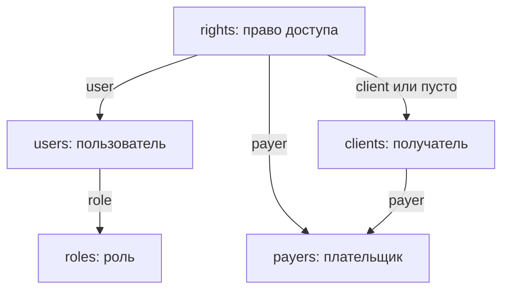

# Актуальная модель доступа PocketBase

Контрольная точка: 2026-10-08. Основание — сообщения владельца о VM и проверенный
исходный standalone 3.6.3 в ветке `feature/v3.6.4-demo-showcase`. Это спецификация
для дальнейшей интеграции; актуальный экспорт схемы и API rules VM здесь не получен.

## Коллекции и связи

| Коллекция | Тип / основные поля | Назначение |
| --- | --- | --- |
| `users` | Auth; системный `email`, `name`, `role → roles`, `active`, `must_change_password`; поле `login` может сохраняться в старой схеме | Единственная пользовательская коллекция входа |
| `roles` | `code_role`, `name_role`, `active` | `owner`, `manager`, `viewer`; роль должна существовать и быть активной |
| `payers` | `id_pay`, `kod_pay`, `name_pay`, `phone`, `contact_email`, `active` | Юридические лица / плательщики; `id_pay` связывает запись с КИС |
| `clients` | `id_clt`, `payer → payers`, `kod_clt`, `name_clt`, `active` | Получатели; `id_clt` — ID получателя в КИС |
| `rights` | `user → users`, `payer → payers`, `client → clients` или пусто, `active` | Назначение пользователю области доступа |

Это названия и смысл полей. Обязательность, типы/ограничения ID, индексы,
cardinality relations и точные выражения API rules перед миграцией сверяются с
фактическим экспортом VM. Email пользователя обязателен для входа и восстановления;
ранее также принято требование обязательных контактных email у создаваемых
плательщиков/получателей. Наличие поля email у получателя в текущем экспорте надо
проверить; не изобретать название поля и не подставлять фиктивный адрес.

Рабочий standalone 3.6.3 валидирует email и отправляет его как `identity` в
`POST /api/collections/users/auth-with-password`. Поэтому прежнее указание
входить по `kis_code` или считать `users.login` текущим логином не переносится
автоматически. При адаптации React сверить Password auth → Identity fields и
сохранить вход по email, используемый рабочим standalone.

`payers` и `clients` не являются учётными записями для прямого пользовательского
входа. Названия в UI: «Плательщики» / «Юридические лица», «Получатели».
Техническую коллекцию `rights` пользователю не показываем.

## Как вычисляется доступ

1. Пользователь и его роль должны быть активны. Неизвестная/пустая/неактивная
   роль не даёт доступ. Обязательная смена пароля блокирует бизнес-операции.
2. Рассматриваем только активные `rights`, относящиеся к этому пользователю,
   и только активных плательщиков.
3. Для выбранного плательщика наличие права с пустым `client` разрешает **всех
   активных получателей этого плательщика**.
4. Если общего права нет, разрешено объединение конкретных активных получателей
   из его прав, без дубликатов. Каждый получатель должен принадлежать этому payer.
5. Неактивный `client`, чужая relation или недоступный payer не расширяют область
   доступа. Несогласованная схема обрабатывается отказом, а не демо-профилем.
6. Нет действующих прав — нет доступных справочников и бизнес-данных. Право без
   `client` не является правом на всех плательщиков.

| Пример права для выбранного плательщика | Доступ |
| --- | --- |
| Активное право, `client` пуст | Все активные получатели этого плательщика |
| Два активных права с конкретными `client` | Только эти два активных получателя |
| Общее право + конкретные права | Все активные получатели, без дубликатов |
| Только неактивные права | Нет доступа |
| `right.payer` не равен `client.payer` | Ошибка области доступа; чужого получателя не выдавать |

Проверка коллекций API rules и проверка custom routes `/service/*` нужны обе.
Последняя выполняется на сервере перед каждым обращением к КИС, включая проверку
по уже выданному токену после отключения пользователя/права/плательщика/получателя.
Для списка заказов нельзя использовать весь payer без дополнительной фильтрации,
если у пользователя разрешены только отдельные clients этого payer.

Список прав и получателей загружается полностью с учётом пагинации; первые 200
записей не являются всей областью доступа. Для масштаба около 600 точек нельзя
терять последующие страницы или расширять права при ошибке очередной страницы.

`viewer` имеет только чтение. Создание, изменение и отмена требуют разрешённой
роли и права на получателя; точную матрицу операций `owner/manager` проверяем перед
реализацией записи. Скрытая кнопка в UI не заменяет серверный запрет.

## Сессия и выбор плательщика

- Один доступный payer выбирается автоматически; несколько требуют выбора.
- F5 вызывает `users/auth-refresh` и заново проверяет роль/права/область доступа.
- Токен хранится только в `sessionStorage`; пароль и полная auth-запись не сохраняются.
- Logout очищает токен и выбранный payer/client, зависимые данные и кэши.
- Смена плательщика очищает получателя, корзину, матрицу, заказы, документы и правки;
  несохранённые данные требуют подтверждения, устаревшие ответы отсекаются.
- 401 означает сброс сессии и повторный вход. При 403 показать безопасный отказ и
  обновить контекст доступа; блокировка аккаунта/роли должна закрывать кабинет.
- Сбой PocketBase/КИС никогда не включает демонстрационные данные рабочего режима.

Email-auth не доказывает готовность восстановления пароля: почтовую отправку,
SMTP и переход по ссылке восстановления нужно проверить отдельно.

## Расхождение с кодом GitHub

| Слой | Проверенная схема | Как использовать |
| --- | --- | --- |
| `main`, React 3.5 | `buyers/outlets`, вход по `kis_code` | Историческая стабильная основа, не текущая схема VM |
| React 3.6 в `feature/v3.6-user-multi-buyer-auth` | `users/user_buyers/buyers/outlets`, роль в связи | Ранний этап; нужна адаптация к актуальной модели |
| Standalone 3.6.3 в `feature/v3.6.4-demo-showcase` | `users/roles/rights/payers/clients`, email-auth | Сохранённый исходник рабочей модели; исходный SHA256 указан в RELEASE.json |
| Demo Showcase 3.6.4 | Реальный PocketBase + локальные бизнес-данные для `DEMO-*` | Проверка интерфейса; не подтверждает подключение КИС |

Замена имён коллекций в env не превращает `user_buyers` в `rights`: меняются
расположение роли и смысл пустого `client`. Нужны согласованные изменения
адаптера, типов, проверки прав, API rules и тестов. Старую миграцию ветки 3.6
не применять поверх действующей VM без сверки и резервной копии.

## Приёмка новой модели

1. Один payer: успешный вход и автоматический выбор.
2. Несколько payers: обязательный выбор и безопасное переключение.
3. Общее право: все активные clients только этого payer.
4. Конкретное право: только указанные clients.
5. Нет прав: нет справочников, заказов и mock fallback.
6. Отключение user, role, right, payer или client блокирует соответствующий доступ.
7. Прямой запрос к чужим payer/client отклоняется API rules и `/service/*`.
8. Logout, F5, отзыв прав и быстрые переключения не восстанавливают чужой контекст.
9. Вход по email и сброс пароля через настроенную почту проверяются отдельно.

Ранее владелец подтверждал вход, переключение контекста и изменение active на VM.
Полный протокол этих сценариев и актуальные rules здесь не получены; не считать
всю таблицу автоматически пройденной.
