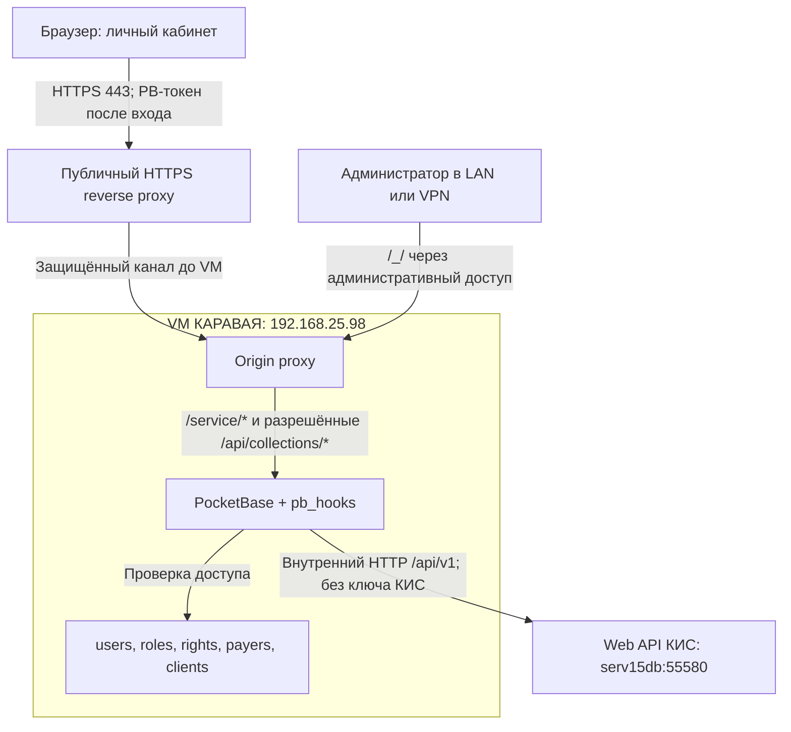

# PocketBase → Web API КИС: решение на 8 октября 2026

Статус: архитектура согласована владельцем проекта. Обработчики `/service/*` и
успешный запрос реального каталога на VM в этой контрольной точке не подтверждены.
Модель доступа описана в [POCKETBASE_ACCESS_MODEL.md](POCKETBASE_ACCESS_MODEL.md).

## Принятое решение

1. PocketBase остаётся на внутренней VM `192.168.25.98`.
2. PocketBase выполняет роль шлюза через серверные `pb_hooks/*.pb.js`.
3. Публичный бизнес-API использует `/service/*`. `/api/v1` остаётся только на
   закрытом соединении PocketBase → КИС.
4. Внутренний адрес КИС: `http://serv15db:55580/api/v1`.
5. Отдельный секретный ключ / сервисный токен КИС в выбранной схеме не используем.
   Это отменяет прежнее предположение о необходимости такого токена.
6. PocketBase проверяет пользователя, роль и право на плательщика/получателя
   перед каждой бизнес-операцией и фильтрует ответ перед отправкой браузеру.
7. Сначала подключаем чтение каталога, затем чтение заказов. Запись заказов —
   отдельный следующий этап после проверки чтения и контракта КИС.

Отсутствие ключа КИС — принятое решение, но ещё не результат сетевой проверки.
Нужно подтвердить именно с VM PocketBase, что Web API КИС разрешает запрос без
дополнительной авторизации. Доступ из своей сети сам по себе этого не доказывает.
Если КИС вернёт 401/403, фиксируем отказ и согласуем серверную настройку доступа.
Не передаём туда PB-токен и не добавляем неизвестные креды автоматически.

## Адреса и границы сети

| Назначение | Адрес / путь | Статус |
| --- | --- | --- |
| Текущий локальный ЛК и PocketBase | `http://192.168.25.98:8090/` | Рабочий контур по сообщениям владельца; из этой среды VM не проверялась |
| Админка PocketBase | `http://192.168.25.98:8090/_/` | Только административный доступ из LAN/VPN |
| Предлагаемый публичный origin | `https://lk.karavay.spb.ru` | Целевой пример; DNS, сертификат и публикация не подтверждены |
| Публичный бизнес-API | `/service/*` | Согласованные имена; реализация предстоит |
| Вход и refresh | `/api/collections/users/auth-with-password`, `/api/collections/users/auth-refresh` | Нативные маршруты PocketBase; ограничение касается `/api/v1`, не всех `/api/*` |
| Web API КИС | `http://serv15db:55580/api/v1` | Внутренний upstream; ответы требуют проверки с VM |

Браузер обращается только к origin ЛК. В runtime-конфигурации фронтенда, URL
запросов, заголовках и ответах не должно быть внутреннего `serv15db:55580`.
Решение не требует переименовать API на стороне КИС.

## Интернет-схема с PocketBase на VM

Это схема размещения, а не описание уже настроенных прокси. В текущем LAN-контуре
HTML и API обслуживаются PocketBase на `:8090`; origin proxy и внешнее HTTPS
добавляются при публикации. Ответ КИС проходит через PocketBase и возвращается
тем же путём, после проверки области доступа и допустимых полей.

| Способ публикации | Условие | Соединение до VM |
| --- | --- | --- |
| Reverse proxy внутри сети КАРАВАЯ | Есть публичный IP, доступ к DNS и входящему 443 | Прокси перед PocketBase; прямой доступ к 8090 извне закрыт |
| Российский VPS как внешний reverse proxy | VM остаётся внутри сети, наружу выходит только защищённый туннель | Рекомендуемый вариант для закрытой VM: WireGuard между VPS и сетью КАРАВАЯ; HTTPS/mTLS между прокси можно добавить отдельно |

Выбор способа публикации и настройка туннеля ещё не выполнены. Ключи VPN и
сертификаты HTTPS/mTLS относятся к защите транспорта; они не являются ключом КИС.
Производственные данные и резервные копии сохраняем в российском контуре согласно
ранее принятому требованию проекта.

| Граница | Требование |
| --- | --- |
| Браузер → публичный прокси | HTTPS, корректный сертификат; предпочтительно один origin для HTML, auth и `/service/*` |
| Внешний прокси → VM | Закрытый защищённый канал; не отправлять логины и PB-токены по открытому HTTP через интернет |
| Прокси → PocketBase | Loopback при совместном размещении либо закрытая сеть с firewall; фактический bind проверяется при развёртывании |
| PocketBase → КИС | Согласованный внутренний HTTP; `:55580` не публикуется, доступ рекомендуется разрешить только от `192.168.25.98` |
| Администрирование | `/_/` доступно через LAN/VPN/allowlist; не через общедоступный origin ЛК |
| Публичные порты | 443; 80 только при необходимости redirect/ACME; 8090 и 55580 не открывать в интернет |

## Публичные маршруты и внутренние вызовы

Для нового контракта предлагаем: `client` ниже — **ID записи `clients` в PocketBase**.
Это соглашение о параметре нужно закрепить при реализации. PocketBase сам извлекает
`clients.id_clt` для КИС и проверяет связь `clients.payer`. Нельзя считать ID
PocketBase, код получателя и числовой ID КИС взаимозаменяемыми.

| Запрос браузера | Действие PocketBase | Внутренний вызов КИС | Этап |
| --- | --- | --- | --- |
| `GET /service/context` | Пользователь, активная роль, разрешённые плательщики и получатели | Не нужен | Каталог доступа |
| `GET /service/catalog?client=<pb_client_id>` | Проверить право; получить `id_clt`; проверить дату/группу | `GET /api/v1/clients/{id_clt}/matrix` | Первое чтение |
| `GET /service/orders?client=<pb_client_id>` | Проверить право на получателя | `GET /api/v1/clients/{id_clt}/orders` | После каталога |
| `GET /service/orders/{id}` | Подтвердить принадлежность заказа разрешённому получателю | `GET /api/v1/orders/{id}` | После списка заказов |
| `POST /service/orders` | Право записи, получатель, состав и правила количества | `POST /api/v1/orders` | После приёмки чтения |
| `PUT /service/orders/{id}` | Право записи и принадлежность существующего заказа; запрет смены на чужого получателя | `PUT /api/v1/orders/{id}` | После уточнения контракта |
| `DELETE /service/orders/{id}` | Право отмены, принадлежность и допустимость операции | Метод отмены КИС нужно подтвердить; публичный DELETE не доказывает наличие DELETE upstream | После уточнения контракта |

Для matrix прежний контракт содержит `DateOrd` (Unix timestamp) и `Group=0|1`.
Их точную семантику и формат ответа сверяем с реальным Web API до реализации;
самого параметра `client` может быть недостаточно. Параметры upstream передаём
по разрешённому списку, а не копируем всю query-строку браузера.

Таблица фиксирует имена внешних операций, но не утверждает, что все они уже
существуют. Контракт JSON, пагинация, статусы и формат создания/отмены заказов
должны быть дополнены по фактическим ответам КИС. Документы подключаются позже;
публичный путь для них в переданном обсуждении ещё не зафиксирован.

Исторический [contracts/openapi.yaml](../contracts/openapi.yaml) и старые
адаптеры используют `/api/v1`. Это материал предыдущего этапа, а не новый
публичный контракт. При реализации потребуется согласованно обновить контракт,
клиент и тесты; простая замена одного `servers.url` не создаёт `/service/*`.

## Обязательная проверка каждого обработчика

1. Принимать только пользовательскую авторизацию `users`: для custom routes
   использовать `$apis.requireAuth("users")`, затем проверять `e.auth`.
2. Проверить `user.active`, наличие и активность роли; при обязательной смене
   пароля бизнес-доступ блокировать до завершения отдельного сценария.
3. Найти активные `rights` текущего пользователя и активных `payers/clients`.
   Серверное чтение через `e.app` само по себе не заменяет проверку прав.
4. Проверить отношение `client.payer` и покрытие получателя конкретным либо
   общим правом. Значение `payer` от браузера не является доказательством доступа.
5. Для заказа установить его фактического получателя: принадлежность может
   проверяться по безопасному ответу КИС на сервере, но детали не выдаются и
   изменения не выполняются, пока эта проверка не завершена. При отсутствии
   необходимых полей отказывать.
6. Использовать только фиксированный upstream и заранее зарегистрированные
   маршруты. Не принимать от клиента URL, host, произвольный путь или заголовки
   для передачи в КИС; учитывать редиректы upstream, чтобы не уйти на чужой host.
7. Проверить формат JSON и область данных ответа; вернуть только разрешённые
   бизнес-поля. Не пробрасывать сырые ошибки, внутренние адреса и upstream-заголовки.

Права распространяются и на прямые запросы к коллекциям PocketBase. API rules
нужно сверить с фактической схемой и проверить обычным пользовательским токеном.
Ограничение списка в React или query `filter` не обеспечивает изоляцию.

## Ошибки, таймауты и запись

| Ситуация | Поведение `/service/*` |
| --- | --- |
| Нет/невалидный PB-токен | 401; не вызывать КИС |
| Неактивный пользователь/роль или нет права на получателя | 403; не вызывать КИС |
| Некорректные обязательные параметры | 400/422 по согласованному контракту |
| Ошибка соединения, некорректный ответ или отказ upstream | 502 с безопасным сообщением |
| Таймаут upstream | 504 |
| Любой отказ | Без демо-данных; корзину и несохранённые правки не уничтожать |

Для первого чтения предлагаем явный таймаут КИС 10 секунд; это стартовая настройка
для проверки, а не измеренная допустимая задержка. Таймауты прокси и клиента
должны позволять серверу вернуть штатную ошибку. `$http.send()` принимает timeout
в секундах, блокирует обработчик и возвращает всё тело ответа; потоковые ответы
и SSE этим способом не поддерживаются. Для большой нагрузки/документов можно
рассмотреть расширение PocketBase на Go или отдельный шлюз, сохранив `/service/*`.

В журнале оставляем request ID, операцию, длительность, статус и минимальные ID
контекста; пароли, `Authorization` и полные персональные записи не журналируем.
Для POST/PUT нельзя автоматически повторять запрос после неопределённого результата
без согласованного механизма идемпотентности. Блокировка кнопки в UI не заменяет
серверную защиту от повторной записи.

## Первый практический шаг и критерии приёмки

Сначала с VM проверить DNS `serv15db`, TCP 55580, доступ Web API без ключа и
фактический ответ matrix на разрешённом тестовом получателе. Затем подготовить
`pb_hooks/karavay-kis.pb.js` с единственным бизнес-маршрутом `GET /service/catalog`.
Первый обработчик добавлен в ветке `feature/pb-kis-catalog`.
Контракт, зависимости transport, результаты локальных тестов и приёмка VM:
[POCKETBASE_CATALOG_IMPLEMENTATION.md](POCKETBASE_CATALOG_IMPLEMENTATION.md).
Развёртывание на действующей VM и успешное чтение настоящего КИС не выполнялись.

| Проверка | Ожидаемый результат |
| --- | --- |
| Запрос без входа | 401, ноль исходящих вызовов КИС |
| Вошедший пользователь без права на получателя | 403, ноль исходящих вызовов КИС |
| Разрешённый активный пользователь/роль/right/payer/client | 200, каталог из реального КИС |
| Чужой client либо несовпадение payer/client | 403, чужие данные не возвращаются |
| Отключение любого звена доступа после входа | Следующий запрос отклоняется |
| Недоступность КИС / таймаут / неверный JSON | 502 / 504 / 502; без mock fallback |
| Проверка Network браузера | Бизнес-запросы идут к `/service/*`; нет запросов к `serv15db` или внешнему `/api/v1` |
| Осмотр JSON и ошибок | Нет внутренних URL, PB-токена и чужих данных |

Факт 200 для локальных демонстрационных товаров не является проверкой КИС.
Полный тест HTTPS через внешний origin проводится после настройки публикации.

## Документация PocketBase

Проверено по официальным материалам 2026-10-08; установленную версию VM нужно
сверить отдельно до написания hook:

- [Custom routes, auth middleware и e.auth](https://pocketbase.io/docs/js-routing/).
- [Исходящие HTTP-запросы и ограничения $http.send](https://pocketbase.io/docs/js-sending-http-requests/).
- [pb_hooks, изоляция обработчиков и CommonJS-модули](https://pocketbase.io/docs/js-overview/).

JSVM PocketBase не является Node.js/браузером. Общие helper-функции нельзя просто
объявить снаружи handler и ожидать доступности внутри него; общий модуль загружается
через `require()` внутри обработчика, без изменяемого глобального контекста пользователя.
